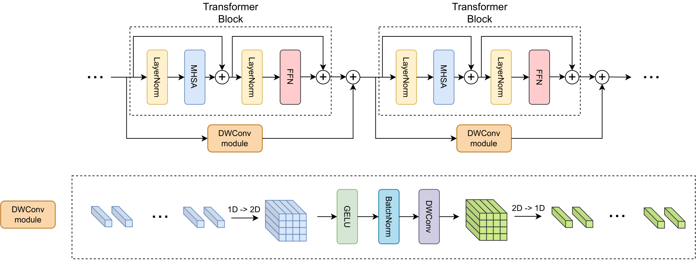
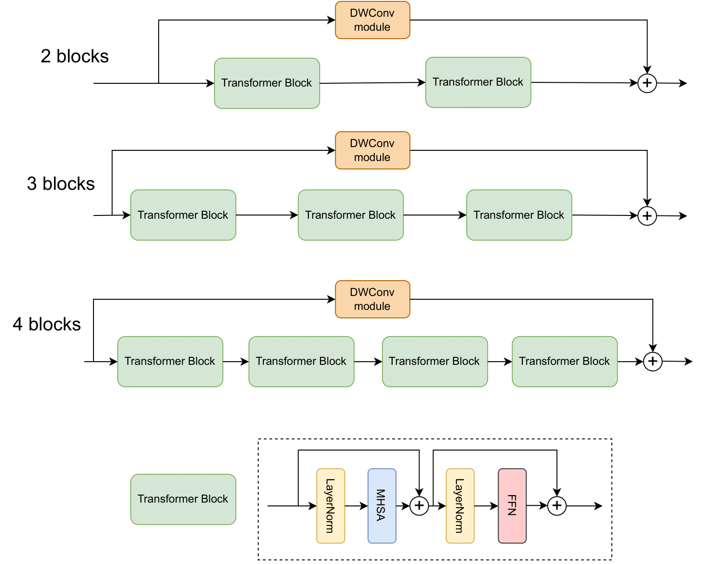
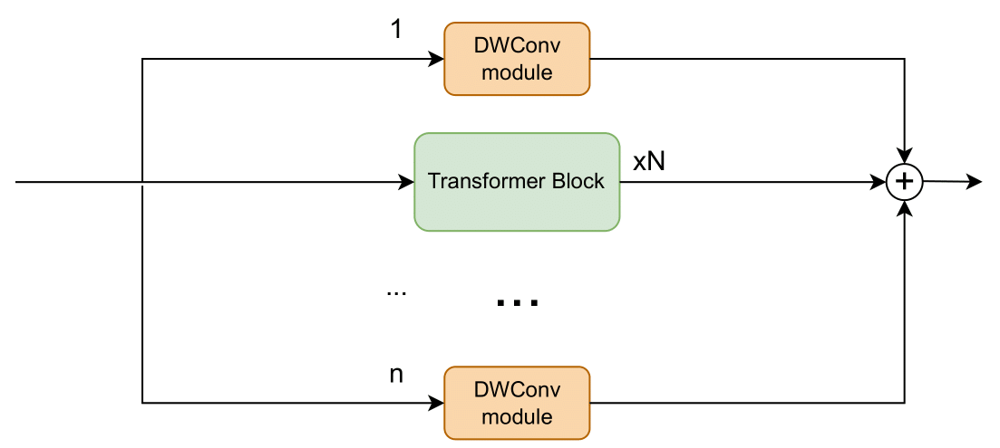

# Depth-Wise Convolutions in Vision Transformers for Efficient Training on Small Datasets

## Introduction

The Vision Transformer (ViT) leverages the Transformer's encoder to capture global information by dividing images into patches and achieves superior performance across various computer vision tasks. However, the self-attention mechanism of ViT captures the global context from the outset, overlooking the inherent relationships between neighboring pixels in images or videos. Transformers mainly focus on global information while ignoring the fine-grained local details. Consequently, ViT lacks inductive bias during image or video dataset training. In contrast, convolutional neural networks (CNNs), with their reliance on local filters, possess an inherent inductive bias, making them more efficient and quicker to converge than ViT with less data. In this paper, we present a lightweight Depth-Wise Convolution module as a shortcut in ViT models, bypassing entire Transformer blocks to ensure the models capture both local and global information with minimal overhead. Additionally, we introduce two architecture variants, allowing the Depth-Wise Convolution modules to be applied to multiple Transformer blocks for parameter savings, and incorporating independent parallel Depth-Wise Convolution modules with different kernels to enhance the acquisition of local information. The proposed approach significantly boosts the performance of ViT models on image classification, object detection and instance segmentation by a large margin, especially on small datasets, as evaluated on CIFAR-10, CIFAR-100, Tiny-ImageNet and ImageNet for image classification, and COCO for object detection and instance segmentation. Our paper is available at [arxiv](https://arxiv.org/abs/2407.19394).

## Approach

### Main Architecture
<div style="color:#0000FF" align="center">

</div>

### Two Variants
<div style="color:#0000FF" align="center">


</div>


## Installation
The implementation of the original Vision Transformers comes from [Swin Transformer](https://github.com/microsoft/Swin-Transformer) and [vit-pytorch](https://github.com/lucidrains/vit-pytorch). Please refer to [get_started.md](https://github.com/microsoft/Swin-Transformer/blob/main/get_started.md) for more information about the installation.


## Training
For training the models on the the datasets, for example, we could utilize the following command line to train ViT model on CIFAR10, CIFAR100, Tiny-ImageNet:

```
python -m torch.distributed.launch --nproc_per_node=[num of GPUs] --master_port 12345 main.py --cfg configs/vit/vit_tiny_16_224_cifar10.yaml --data-path [data path to CIFAR10] --batch-size [batch size]
```

```
python -m torch.distributed.launch --nproc_per_node=[num of GPUs] --master_port 12345 main.py --cfg configs/vit/vit_tiny_16_224_cifar100.yaml --data-path [data path to CIFAR100] --batch-size [batch size]
```

```
python -m torch.distributed.launch --nproc_per_node=[num of GPUs] --master_port 12345 main.py --cfg configs/vit/vit_tiny_16_224_tiny_imagenet.yaml --data-path [data path to Tiny-ImageNet] --batch-size [batch size]
```

Similar implementation could be applied to other models and datasets. For more implementation, please visit [get_started.md](https://github.com/microsoft/Swin-Transformer/blob/main/get_started.md).


